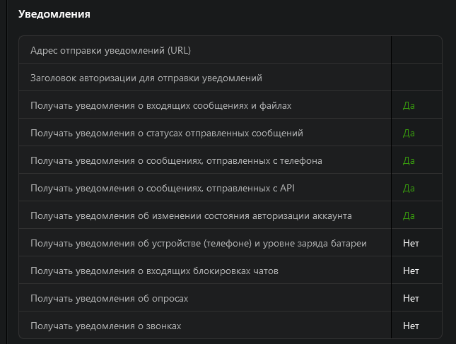

# WhatsApp client

Powered by Green-Api https://green-api.com

## [Live preview on GithubPages](https://zoricmats.github.io/green-api/)

## How to use

1. Create instance and configure it: https://green-api.com/docs/before-start/
2. Configure instance to get new messages via http requests: https://green-api.com/docs/api/receiving/technology-http-api/ReceiveNotification/
3. Configure instance to get chat history: https://green-api.com/docs/api/journals/GetChatHistory/
4. To authorize use `apiUrl`, `apiTokenInstance` and `idInstance` values from your instance dashboard

Settings example:

## How to use locally

1. Clone repository
2. Install NPM dependencies: `npm i`
3. Run development server: `npm start`